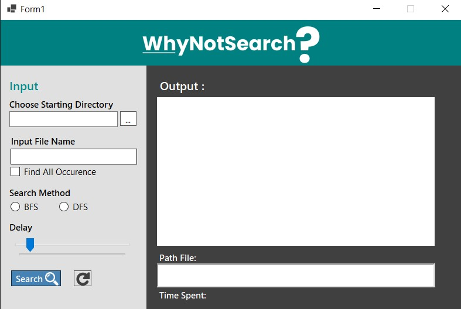
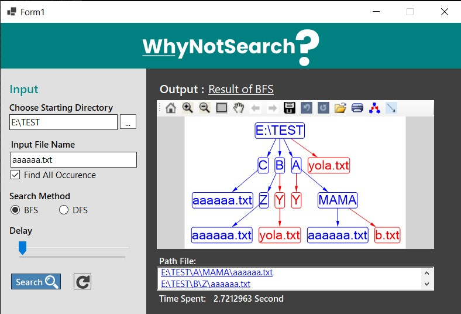

# Pengaplikasian Algoritma BFS dan DFS dalam Implementasi Folder Crawling
Tugas Besar 2 IF2211 Strategi Algoritma Semester II Tahun 2021/2022 Oleh WhyNotSearch

## Table of Contents
* [Author](#author)
* [General Information](#general-information)
* [Requirement](#requirement)
* [Setup](#setup)
* [How To Use Program](#how-to-use-program)
* [Screenshot](#screenshoot)
* [Status](#status)
* [Contact](#contact)

## Author
|NIM|Nama|
|---|---|
|13520066|Putri Nurhaliza|
|13520140|Febryola Kurnia Putri|
|13520147|Aloysius Gilang Pramudya|

## General Information
Dalam tugas besar 2 IF2211 Strategi Algoritma Tahun 2021/2022 Semester 2 ini, Anda akan diminta untuk membangun sebuah aplikasi GUI sederhana yang dapat melakukan pencarian file atau folder tanpa menggunakan fitur search yang telah tersedia di file explorer. Dengan memanfaatkan algoritma Breadth First Search (BFS) dan Depth First Search (DFS), Anda dapat menelusuri setiap file dan folder yang ada di directori yang dapat menampilkan satu atau lebih file atau folder berdasarkan inputan yang Anda berikan.
## Requirement
* C#
* Visual Studio 2019
## Setup
*	Install Visual Studio 2022 atau versi sebelumnya
*	Create project Desktop app
## How to Use Program
1.	Jalankan executable code (src.exe) pada folder bin
2.	Browse dan pilih file/folder yang ingin dilakukan pencarian 
3.	Jika hanya ingin mencari satu file/folder saja, maka abaikan button “Find All Occurence”
4.	Jika ingin mencari lebih dari satu file/folder, maka klik button “Find All Occurance”
5.	Pilih Metode pencarian (BFS atau DFS)
6.	Atur Delay penggambaran graf yang diinginkan
7.	Klik tombol search
8.	Kumpulan path file/folder yang dicari akan masuk ke box path dan jika ingin di klik akan membuka direktori tempat file/folder tersebut berada
9.	Jika ingin melakukan pencarian ulang, klik button refresh yang berada di sebelah tombol search
10.	Lakukan ulang seperti Langkah 1-8 

## Screenshot Program
* Tampilan Awal Program

* Setelah dilakukan Pencarian

## Status
Project is: _finished_
## Contact
This program was made by WhyNotSearch
1. Putri Nurhaliza (13520066).
   email : 13520066@std.stei.itb.ac.id
2. Febryola Kurnia Putri (13520140).
   email : 13520140@std.stei.itb.ac.id
3. Aloysius Gilang Pramudya (13520147).
   email : 13520147@std.stei.itb.ac.id

